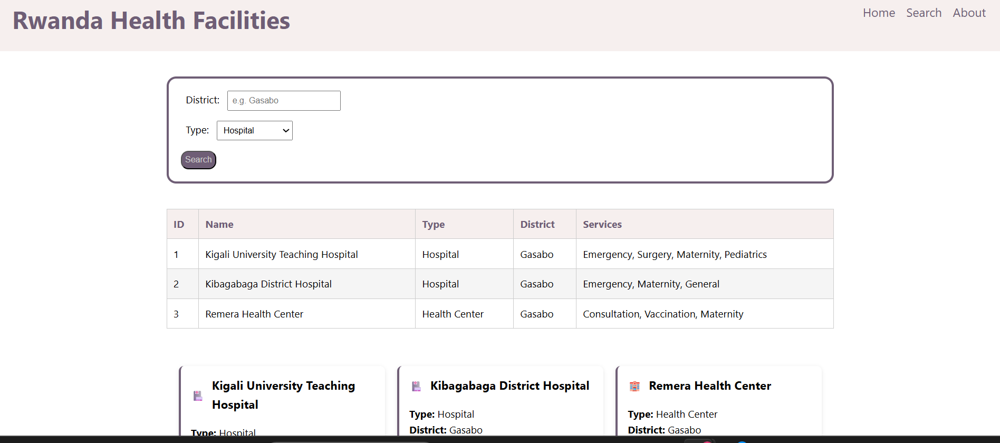

# Rwanda-health-facilities-frontend

A Python-based API and frontend dashboard for managing and querying health facility data in Rwanda.

## Frontend

### What the page does
- Displays a list of Rwanda health facilities in a table
- Allows filtering facilities by district and type
- Shows facility cards with name, type, district and services
- Fully responsive — works on mobile, tablet and desktop

### Live URL
 [View Live Site](https://sylivie211.github.io/rwanda-health-facilities-frontend/)

### Screenshot

## Project Structure

### Features
- Live API connection — fetches real-time facility data from a Python backend instead of hardcoded data
- Search filtering — filter facilities by district and/or type, with the table and both charts updating together
- Chart.js charts — a line chart showing facilities per district, and a pie chart showing facilities by type
- Responsive design — layout adapts cleanly across mobile, tablet, and desktop
 
### How to Run Locally
1) Clone this repository:
git clone https://github.com/Sylivie211/rwanda-health-facilities-frontend.git
   cd rwanda-health-facilities-frontend
2) Clone and start the backend API
git clone https://github.com/Sylivie211/rwanda-health-facilities-api.git
   cd rwanda-health-facilities-api
   python app.py

This runs the API on http://localhost:8080

3)  Open docs/index.html in your browser (or serve it with a local server, e.g. VS Code's Live Server extension)

### Built With
- HTML5
- CSS3
- Vanilla JavaScript
- Chart.js
- fetch() API

### Backend API
[github.com/Sylivie211/rwanda-health-facilities-api]